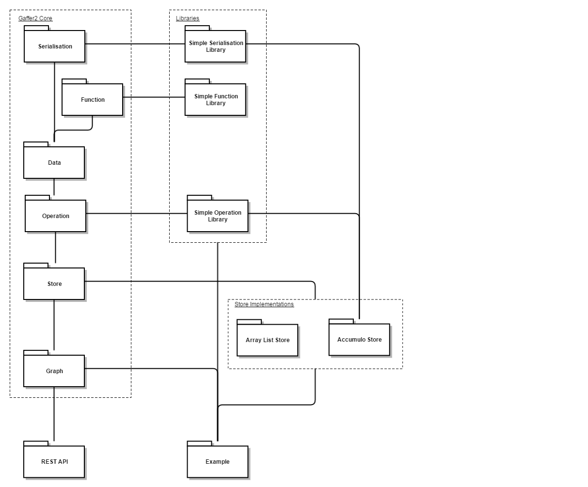

# Components

#TODO: THIS WILL PROBABLY BE ALREADY DESCRIBED IN THE README

## Architecture

## Data
This component encapsulates the graph data model and the schema that defines it.

Every record that can be added to a graph is an `Element`, which is either an `Entity` or an `Edge`. Every `Element` has an
`identifiers` (for `Entities`, this is the vertex they relate to, and for `Edge`s, this is the source and destination vertices,
and the direction), which ensures that all data conforms to the graph structure, and Properties, which are a collection
of Key-Value pairs that hold the application specific data associated with the graph.

`Element`s have an intentionally loose structure in order to support the widest possible set of use cases. Application
specific control is provided by a `Schema`, which contains a set of `ElementDefinition`s. Each `ElementDefinition` controls
the `identifiers` and `Properties` that are allowed for that `Element` through a number of `Predicate`s.

## Function
GAFFER allows aggregation and transformation of graph elements, which are carried out by Functions. Configurable
Processors apply Functions to Properties.

The `Aggregator` Processor combines many instances of 'the same' Element (e.g matching identifiers). Assume a
graph contains an Element that has a 'count' Property that is an Integer. When a new Element with the same group and
identifiers are added to a Store, that Store may provide the ability to aggregate the existing and new Elements.
By configuring the Aggregator to combine the 'count' Property using the 'sum' Function, the Store can apply the correct
logic to merge the Element instances.

The `Transformer` Processor allows GAFFER to derive additional Properties when viewing an Element. Imagine an Element that
represents a Rectangle, for example. If we want to provide Properties that describe the 'length', 'width' and 'area' of
that Rectangle, then we might want to reduce the storage requirements of that Element by only storing the 'length' and
'width' Properties. We can configure the Transformer to apply the 'product' Function to the 'length' and 'width' Properties
in order to calculate the 'area' Property on the fly.

## Operation
`Operation`s describe the actions that can be performed against a graph. `Store`s will implement an `OperationHandler` to
locate and execute the specific implementation of an `Operation` for that `Store`.

- `OperationWithSchema` allows an `Operation` to be executed within a particular `View` (a subset of the `Graph`).
- `SeededOperation`s allow an additional filter to be applied when executing the `Operation`.

## Graph
The Graph separates the user from the `Store`. It holds an instance of the `Store` and
acts as a proxy for the store, delegating `Operation`s to the store.

The Graph provides users with a single point of entry for executing operations on a store.
This allows the underlying store to be swapped and the same operations can still be applied.

Graphs also provides a view of the data with a instance of `View`. The view filters out unwanted information
and can transform `Properties` into transient properties such as averages.

When executing operations on a graph, an operation view would override the graph view.

## Serialisation

## Store
The `Store` is responsible for holding `Element`s and performing the Operations submitted via the `Graph`. It can be
configured with a `StoreSchema`, which contains details of how the data should be stored, including serialisation
instructions and the position of the `ElementSeeds` and `Properties` within a record.

`Store`s advertise the set of Operations that they can perform, and each `Store` is free to implement the Operation
differently - optimised for the underlying storage technology. A `Store` based on a relational database would likely
implement an operation by running a SQL query, where an Accumulo Store might use a custom iterator, for example.

### Store Implementations

#### Accumulo Store

#### Array List Store

