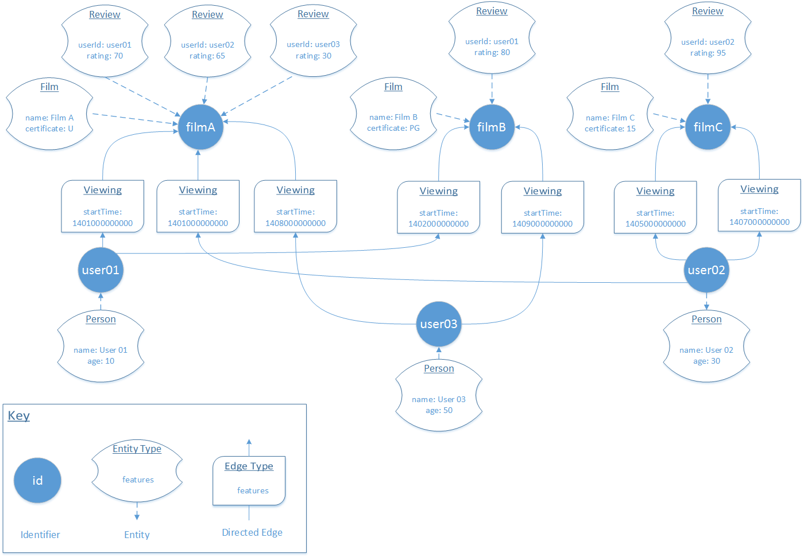

# Getting Started
We've included an example project to help you get familiarised with Gaffer. It shows how you...

Let's walk though how it was created.

## Creating a Data Model

### Domain Objects

### Serializers

## Defining our schemas

### Data Schema
The first step is to write our `DataSchema`. The `DataSchema` contains the logical definition of the different `edges`,
`entities` and `types` in our graph, their `identifiers` and `properties` and how functions such as Aggregation and
Validation are applied.

    {
      "edges": {},
      "entities": {},
      "types": {}
    }

To define our `film` entity, we need to create a new object within "`entities`" called "`film`" (the entity group),
state the "`vertex`" and "`properties`" that `film`s will have, and the types that will be used to represent that vertex or property.

    "film": {
      "vertex": "filmId.string",
      "properties": {
        "name": "name.string",
        "certificate": "certificate"
      }
    },

Finally, We can define our `types` that determine the `Class` of each property and identifier, and also how they will be
validated, and aggregated. We also could have done this as part of the `properties` and `vertex` definitions.

In our `film` example we need three types:

- `name.string` - This will hold the name of our film. Films should always have a name so we'll define an `Exists` 
validator. The same film may also have multiple names, for example working titles, or translated names; so we also
define a `StringConcat` aggregator.

     "name.string": {
       "class": "java.lang.String",
       "aggregatorFunction": {"class": "gaffer.function.simple.aggregate.StringConcat"},
       "validator": {
         "functions": [
           {"function": {"class": "gaffer.function.simple.filter.Exists"}}
         ]
       }
     }

- `certificate` - This will hold the BBFC Certification (U, PG, 12A, 15, or 18) for the film. We'll create a custom
`Certificate ` enum to represent this in a moment, and again define the aggregator and any validators.

     "certificate": {
       "class": "gaffer.example.data.Certificate",
       "aggregatorFunction": {"class": "gaffer.function.simple.aggregate.ComparableMax"},
       "validator": {
         "functions": [
           {"function": {"class": "gaffer.function.simple.filter.Exists"}}
         ]
       }
     }

- `filmId.string` - This will hold an identifier for our film. Like the `name.string` type, it'll be a String that must
exist, however this time we don't define an aggregator. When we perform an operation, the AccumuloStore aggregates all
elements with an identical `Key` - made up of the Entity type (e.g. "film"), the vertex and other properties we decide
 to store in the Key.

    "filmId.string": {
      "class": "java.lang.String",
       "validator": {
         "functions": [
          {"function": {"class": "gaffer.function.simple.filter.Exists"}}
         ]
       }
     }

### Store Schema
The `StoreSchema` defines the physical definition of how the data model maps to the underlying `Store` and how each
property should be serialised.

Table-based store implementations, such as the AccumuloStore, may require additional configuration such as the column
position that each property will be stored in. Other store implementations may require other information.

Using our example of a 'film' entity above and using the Accumulo store implementation, we get:

    "film": {
      "properties": {
        "name": {
          "position": "VALUE"
        },
        "certificate": {
          "position": "VISIBILITY",
          "serialiserClass": "gaffer.example.serialiser.CertificateVisibilitySerialiser"
        }
      }
    }

For the `certificate` property, we're using the using the CertificateVisibilitySerialiser we created earlier, and have
told Accumulo to store the property in the `VISIBILITY` column. This will mean that Accumulo is able to use
authentication to filter results they shouldn't be able to see. The 

We've omitted the serialiserClass here for the `name` property, so Gaffer will fall-back to use the standard
`JavaSerialiser`.

## Operations and Operation Chains
The way we interact with the graph is though Operations, and Operation Chains.

## Adding data to our Graph

### Generators

## A simple query
A typical query we might want to perform on our graph is to find all the `Viewing`s of a given film. We've defined a
`Viewing` as a directed `Edge` where the source is a `userId.string` and destination is a `filmId.string`.

This is simple queries we can perform in gaffer, made up of a chain of two operations.

One of the standard operations included in Gaffer is the `GetRelatedEdges` operation. We can pass a number of seed
identifiers into this operation 

### Views
By default this operation would return _all_ `Edge`s found where our seed matches it's source or destination.

`Views` allow us to filter and transform the results, 

### Java

    final OperationChain<Iterable<Viewing>> opChain = new OperationChain.Builder()
            .first(new GetRelatedEdges.Builder()
                    .view(new View.Builder()
                            .edge(ElementType.VIEWING)
                            .build())
                    .addSeed(new EntitySeed("filmA"))
                    .option(Constants.OPERATION_AUTHORISATIONS, AUTH)
                    .build())
            .then(new GenerateObjects.Builder<Edge, Viewing>()
                    .generator(new ViewingGenerator())
                    .option(Constants.OPERATION_AUTHORISATIONS, AUTH)
                    .build())
            .build();

    final Iterable<Viewing> results = graph.execute(opChain);

### JSON

    {
      "operations": [
        {
          "class": "gaffer.operation.impl.get.GetRelatedEdges",
          "view": {
            "edges": {
              "viewing": {}
            }
          },
          "options": {
            "authorisations": "U,PG,_12A,_15,_18"
          },
          "seeds": [
            {
              "gaffer.operation.data.EntitySeed": {
                "vertex": "filmA"
              }
            }
          ]
        },
        {
          "class": "gaffer.operation.impl.generate.GenerateObjects",
          "options": {
            "authorisations": "U,PG,_12A,_15,_18"
          },
          "elementGenerator": {
            "class": "gaffer.example.generator.ViewingGenerator"
          }
        }
      ]
    }

## A more complex query

### Java

    final OperationChain<Iterable<Entity>> opChain = new OperationChain.Builder()
            .first(new GetAdjacentEntitySeeds.Builder()
                    .view(new View.Builder()
                            .edge(ElementType.VIEWING)
                            .build())
                    .addSeed(new EntitySeed("user02"))
                    .option(Constants.OPERATION_AUTHORISATIONS, AUTH)
                    .build())
            .then(new GetEntitiesById.Builder()
                    .view(new View.Builder()
                            .entity(ElementType.REVIEW, new ViewElementDefinition.Builder()
                                    .property(Property.RATING, Long.class)
                                    .property(Property.COUNT, Integer.class)
                                    .property(Property.USER_ID, String.class)
                                    .property(TransientProperty.FIVE_STAR_RATING, Float.class)
                                    .filter(new ElementFilter.Builder()
                                            .select(Property.USER_ID)
                                            .execute(new IsEqual("user02").not())
                                            .build())
                                    .transformer(new ElementTransformer.Builder()
                                            .select(Property.RATING, Property.COUNT)
                                            .project(TransientProperty.FIVE_STAR_RATING)
                                            .execute(new StarRatingTransform())
                                            .build())
                                    .build())
                            .build())
                    .summarise(true)   // Setting the summarise flag to true will aggregate the results when run on a store that supports aggregation
                    .option(Constants.OPERATION_AUTHORISATIONS, AUTH)
                    .build())
            .build();

### JSON

    {
      "operations": [
        {
          "class": "gaffer.operation.impl.get.GetAdjacentEntitySeeds",
          "view": {
            "edges": {
              "viewing": {}
            }
          },
          "options": {
            "authorisations": "U,PG,_12A,_15,_18"
          },
          "seeds": [
            {
              "gaffer.operation.data.EntitySeed": {
                "vertex": "user02"
              }
            }
          ]
        },
        {
          "class": "gaffer.operation.impl.get.GetEntitiesBySeed",
          "view": {
            "entities": {
              "review": {
                "properties": {
                  "rating": "java.lang.Long",
                  "count": "java.lang.Integer",
                  "userId": "java.lang.String",
                  "starRating": "java.lang.Float"
                },
                "transformer": {
                  "functions": [
                    {
                      "function": {
                        "class": "gaffer.example.function.transform.StarRatingTransform"
                      },
                      "selection": [
                        {
                          "key": "rating"
                        },
                        {
                          "key": "count"
                        }
                      ],
                      "projection": [
                        {
                          "key": "starRating"
                        }
                      ]
                    }
                  ]
                },
                "filter": {
                  "functions": [
                    {
                      "function": {
                        "class": "gaffer.function.simple.filter.IsEqual",
                        "not": true,
                        "value": "user02"
                      },
                      "selection": [
                        {
                          "key": "userId"
                        }
                      ]
                    }
                  ]
                }
              }
            }
          },
          "options": {"authorisations": "U,PG,_12A,_15,_18"},
          "summarise": true
        }
      ]
    }

### Transforms
